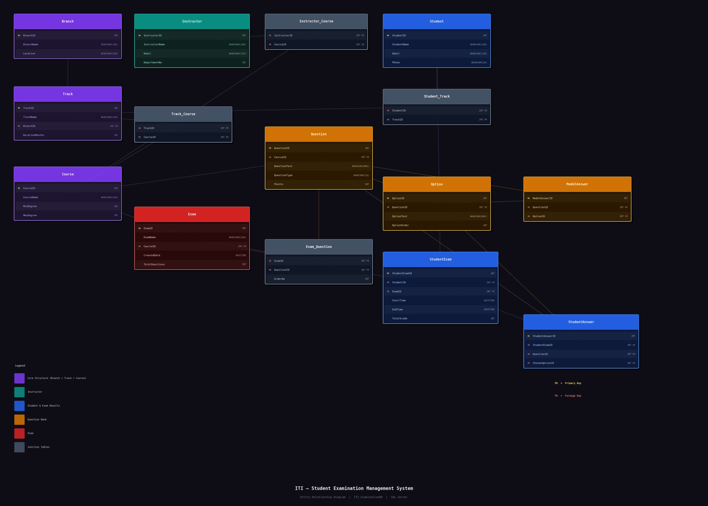

# 🎓 ITI — Student Examination Management System

A database-centric examination management system built with **SQL Server**, designed to manage exams across ITI branches. All core business logic is implemented as stored procedures — from random exam generation to automatic grading.

---

## 👥 Team Members

| Name | 
|---|
| Amena Elsheikh |
| Nathalie Nader |
| Islam Waled |
| Mohammad Abdelkhalek |

---

## 🛠️ Tech Stack

- **Database:** SQL Server 2019+
- **Tool:** SQL Server Management Studio (SSMS)
- **Language:** T-SQL
- **Security:** SQL Server Roles, Row-Level Security (RLS)

---

## 🗺️ Entity Relationship Diagram
 

 
---
 
## 📁 Project Structure

```
📦 ITI_ExaminationDB
├── 📂 ERD
│   └── Entity Relationship Diagram for the database schema
│
├── 📂 Tables
│   └── Create_DB_&_Tables.sql       → Database creation + all 12 tables with constraints
│
├── 📂 Security
│   ├── Roles.sql                    → Server logins, database users, and role assignments
│   └── Permissions.sql             → GRANT, DENY, and Row-Level Security policies
│
├── 📂 Stored Procedures
│   ├── Branch_CRUD_SP.sql           → Insert, Update, Delete, Select for Branch
│   ├── Track_CRUD_SP.sql            → Insert, Update, Delete, Select for Track
│   ├── Course_CRUD_SP.sql           → Insert, Update, Delete, Select for Course
│   ├── Instructor_CRUD_SP.sql       → Insert, Update, Delete, Select for Instructor
│   ├── Student_CRUD_SP.sql          → Insert, Update, Delete, Select for Student
│   ├── Question_bank_CRUD_SP.sql    → InsertQuestion, InsertOption, SetModelAnswer
│   ├── AssignInstructorToCourse.sql → Assign instructor to course
│   ├── RemoveInstructorFromCourse.sql → Remove instructor from course
│   ├── AssignStudentToTrack.sql     → Assign student to track
│   ├── GenerateExam_SP.sql          → Random exam generation per course
│   ├── SubmitExamAnswers_SP.sql     → XML-based answer submission
│   └── CorrectExam.sql              → Automatic exam grading
│
├── 📂 Reports
│   ├── Report_StudentsByDepartment.sql  → Students filtered by department
│   ├── Report_StudentGrades.sql         → Student grades with percentage
│   └── Report_InstructorCourses.sql     → Instructor courses with student count
│
├── 📂 SampleData
│   ├── SampleData.sql               → Branches, Tracks, Courses, Track_Course mappings
│   ├── Instructor_SampleData.sql    → Instructors + course assignments
│   ├── Student_SampleData.sql       → 20 students + track assignments
│   └── QuestionBank_SampleData.sql  → 30 MCQ + 20 TF questions with options and model answers
│
└── 📂 Test
    └── TestScenarios.sql            → All 8 SRS test scenarios with validation queries
```

---

## 🗄️ Database Schema

The system uses **12 tables** organized around these relationships:

```
Branch → Track → Course ↔ Instructor  (via Instructor_Course)
Track ↔ Student                        (via Student_Track)
Course → Exam → Exam_Question ← Question → Option → ModelAnswer
Student + Exam → StudentExam → StudentAnswer
```

### Tables

| Table | Description |
|---|---|
| Branch | ITI branches across Egypt |
| Track | Specialization tracks per branch |
| Course | Courses offered across tracks |
| Track_Course | Junction — tracks to courses |
| Instructor | Instructors with department info |
| Instructor_Course | Junction — instructors to courses |
| Student | Student records |
| Student_Track | Junction — students to tracks |
| Question | MCQ and True/False questions per course |
| Option | Answer choices per question |
| ModelAnswer | Correct answer per question |
| Exam | Generated exams per course |
| Exam_Question | Questions assigned to an exam |
| StudentExam | Student exam attempts with grades |
| StudentAnswer | Individual answers submitted by students |

---

## ⚙️ Core Features

### 🎲 Random Exam Generation
Exams are generated randomly using `NEWID()` — no two exams are identical. The system validates that enough questions exist before creating the exam, and raises a descriptive error if the question bank is insufficient.

### 📝 XML Answer Submission
Students submit answers as an XML document. Skipped questions are simply absent — no NULL rows inserted. The SP parses the XML and inserts one `StudentAnswer` row per answered question.

```xml
<Answers>
  <Answer><QuestionID>1</QuestionID><ChosenOptionID>5</ChosenOptionID></Answer>
  <Answer><QuestionID>2</QuestionID><ChosenOptionID>9</ChosenOptionID></Answer>
</Answers>
```

### ✅ Automatic Grading
`CorrectExam` compares each student answer against the model answer and sums the points. Skipped questions score 0. The result is written back to `StudentExam.TotalGrade` inside a transaction.

### 📊 Reports
| Report | Input | Output |
|---|---|---|
| Report_StudentsByDepartment | @DepartmentNo | Students linked to that department |
| Report_StudentGrades | @StudentID | Grades + percentage per course |
| Report_InstructorCourses | @InstructorID | Courses taught + student count per track |

---

## 🔐 Security

Three roles are implemented as per SRS:

| Role | Access |
|---|---|
| AdminRole | `db_owner` — full control |
| InstructorRole | Read all + Write on exam/question tables + Execute relevant SPs |
| StudentRole | `db_datareader` — read only + Execute submit/grade SPs |

**NFR-05:** `ModelAnswer` table is fully denied to `StudentRole`

**NFR-04:** Row-Level Security is applied on `StudentExam` — students can only see their own exam records using `SESSION_CONTEXT`

---

## 🧪 Test Scenarios

All 8 SRS test scenarios pass:

| # | Scenario | Result |
|---|---|---|
| 1 | GenerateExam — valid inputs | ✅ PASS |
| 2 | GenerateExam — not enough questions | ✅ PASS |
| 3 | SubmitExamAnswers — all questions answered | ✅ PASS |
| 4 | SubmitExamAnswers — one question skipped | ✅ PASS |
| 5 | CorrectExam — all answers correct | ✅ PASS |
| 6 | CorrectExam — all answers wrong | ✅ PASS |
| 7 | All 3 reports return correct data | ✅ PASS |
| 8 | Delete course with existing exams | ✅ PASS |

---

## 🚀 How to Run

1. Open **SQL Server Management Studio (SSMS)**
2. Run the files in this order:
   1. `Tables/Create_DB_&_Tables.sql`
   2. `Security/Roles.sql`
   3. `Security/Permissions.sql`
   4. All files in `Stored Procedures/`
   5. All files in `Reports/`
   6. All files in `SampleData/`
   7. `Test/TestScenarios.sql`

> ⚠️ Always make sure you are connected to `ITI_ExaminationDB` before running any script except `Roles.sql` which starts in `master`.

---

## 📌 Notes

- All text columns use `NVARCHAR` for full Arabic and English support
- All stored procedures use transactions — no partial writes
- Every SP includes a comment block: Purpose / Inputs / Outputs
- FK constraints are explicitly defined with `ON DELETE` rules on every relationship